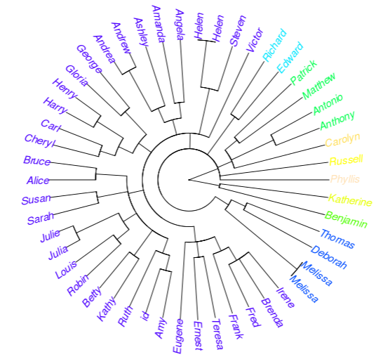

## Overview

This application let you classify a list of string based in the string distance between character vectors. The distance is a generalized Levenshtein (edit) distance, giving the minimal possibly weighted number of insertions, deletions and substitutions needed to transform one string into another.

- ShinyApp: https://eliezermitrani.shinyapps.io/levenshteintree/
- GitHub repo: 

--- .class #id 

## What is the Levenshtein distance

The Levenshtein distance is a string metric for measuring the difference between two sequences. Informally, the Levenshtein distance between two words is the minimum number of single-character edits (i.e. insertions, deletions or substitutions) required to change one word into the other. It is named after Vladimir Levenshtein, who considered this distance in 1965.[1]

For example, the Levenshtein distance between "casa" and "calle" is 3, because we need 3 edits to convert the first word in the second.

    1. casa -> cala (replace the 's' for 'l')
    2. cala -> calla (insert an 'l' between 'l' and 'a')
    3. calla -> calle (replace the 'a' for 'e')


[1] https://en.wikipedia.org/wiki/Levenshtein_distance

--- .class #id 

## How The Levenshtein Tree works

This application is very simple. You must follow 3 steps to get your clustered tree.

<div style='text-align: center;'>
    
</div>

1. Load your data: You can load any plain text format (.csv, .txt, etc.).
2. This file must have all the string that you want to compare.
3. Select the number of rows to read.
4. See your results.

--- .class #id 

## continue

Once you load your data, we use the package ```adist``` to calculate the distance between each string in a matrix with the Levenshtein algorithm.
```
dir <- read.csv(inFile$datapath, header=FALSE, sep=",", quote="", nrows=input$nrow)
d  <- adist(dir$V1)
```
This vector of distances is clustered with the Hirarchical Clustering package ```hclust```.
```
hc$labels <- dir$V1
hc <- hclust(as.dist(d))
```
Finally, we construct our supersexy tree!. I highly recommend you the "ape" package, it's beautiful. Also, we assign the "topo.colors" palette to each cluster.
```
colors = topo.colors(max(d))
clus4 = cutree(hc, max(d))
plot(as.phylo(hc), type = "fan", tip.color = colors[clus4], no.margin = TRUE)
```

--- .class #id 

## continue

- Finally, in the second tab we show the loaded datatable with their cluster.

- Notice that once you load your data, you can change the number of rows, the plot and the datatable will change dynamically.
<div style='text-align: center;'>
    
    
</div>

--- .class #id 

## Application and conclussion

- Edit distance finds applications in computational biology and natural language processing, e.g. the correction of spelling mistakes or OCR errors, and approximate string matching, where the objective is to find matches for short strings in many longer texts, in situations where a small number of differences is to be expected.
- We can improve our application, adding more string comparisong algorithms, like Hirschberg's, Qgrams, Soundex, etc.
<div style='text-align: center;'>
    
    
    
</div>
- We can improve our application, adding more string comparisong algorithms, like Hirschberg's, Qgrams, Soundex, etc.
